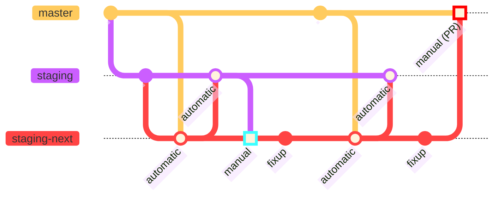

# Contributing to Nixpkgs

This document is for people wanting to contribute to the implementation of Nixpkgs.
This involves interacting with implementation changes that are proposed using [GitHub](https://github.com/) [pull requests](https://docs.github.com/pull-requests) to the [Nixpkgs](https://github.com/nixos/nixpkgs/) repository (which you're in right now).

As such, a GitHub account is recommended, which you can sign up for [here](https://github.com/signup).
See [here](https://discourse.nixos.org/t/about-the-patches-category/477) for how to contribute without a GitHub account.

Additionally this document assumes that you already know how to use GitHub and Git.
If that's not the case, we recommend learning about it first [here](https://docs.github.com/en/get-started/quickstart/hello-world).

## Overview
[overview]: #overview

This file contains general contributing information, but individual parts also have more specific information to them in their respective `README.md` files, linked here:
- [`lib`](./lib/README.md): Sources and documentation of the [library functions](https://nixos.org/manual/nixpkgs/stable/#chap-functions)
- [`maintainers`](./maintainers/README.md): Nixpkgs maintainer and team listings, maintainer scripts
- [`pkgs`](./pkgs/README.md): Package and [builder](https://nixos.org/manual/nixpkgs/stable/#part-builders) definitions
- [`doc`](./doc/README.md): Sources and infrastructure for the [Nixpkgs manual](https://nixos.org/manual/nixpkgs/stable/)
- [`nixos`](./nixos/README.md): Implementation of [NixOS](https://nixos.org/manual/nixos/stable/)

# How to's

## How to create pull requests
[pr-create]: #how-to-create-pull-requests

This section describes in some detail how changes can be made and proposed with pull requests.

> [!Note]
> Be aware that contributing implies licensing those contributions under the terms of [COPYING](./COPYING), an MIT-like license.

0. Set up a local version of Nixpkgs to work with using GitHub and Git
   1. [Fork](https://docs.github.com/en/get-started/quickstart/fork-a-repo#forking-a-repository) the [Nixpkgs repository](https://github.com/nixos/nixpkgs/).
   1. [Clone the forked repository](https://docs.github.com/en/get-started/quickstart/fork-a-repo#cloning-your-forked-repository) into a local `nixpkgs` directory.
   1. [Configure the upstream Nixpkgs repository](https://docs.github.com/en/get-started/quickstart/fork-a-repo#configuring-git-to-sync-your-fork-with-the-upstream-repository).

1. Figure out the branch that should be used for this change by going through [this section][branch].
   If in doubt use `master`, that's where most changes should go.
   This can be changed later by [rebasing][rebase].

2. Create and switch to a new Git branch, ideally such that:
   - The name of the branch hints at the change you'd like to implement, e.g. `update-hello`.
   - The base of the branch includes the most recent changes on the base branch from step 1, we'll assume `master` here.

   ```bash
   # Make sure you have the latest changes from upstream Nixpkgs
   git fetch upstream

   # Create and switch to a new branch based off the master branch in Nixpkgs
   git switch --create update-hello upstream/master
   ```

   To avoid having to download and build potentially many derivations, at the expense of using a potentially outdated version, you can base the branch off a specific [Git commit](https://www.git-scm.com/docs/gitglossary#def_commit) instead:
   - The commit of the latest `nixpkgs-unstable` channel, available [here](https://channels.nixos.org/nixpkgs-unstable/git-revision).
   - The commit of a local Nixpkgs downloaded using [nix-channel](https://nixos.org/manual/nix/stable/command-ref/nix-channel), available using `nix-instantiate --eval --expr '(import <nixpkgs/lib>).trivial.revisionWithDefault null'`
   - If you're using NixOS, the commit of your NixOS installation, available with `nixos-version --revision`.

   Once you have an appropriate commit you can use it instead of `upstream/master` in the above command:
   ```bash
   git switch --create update-hello <the desired base commit>
   ```

3. Make the desired changes in the local Nixpkgs repository using an editor of your choice.
   Make sure to:
   - Adhere to both the [general code conventions][code-conventions], and the code conventions specific to the part you're making changes to.
     See the [overview section][overview] for more specific information.
   - Test the changes.
     See the [overview section][overview] for more specific information.
   - If necessary, document the change.
     See the [overview section][overview] for more specific information.

4. Commit your changes using `git commit`.
   Make sure to adhere to the [commit conventions](#commit-conventions).

   Repeat the steps 3-4 as many times as necessary.
   Advance to the next step if all the commits (viewable with `git log`) make sense together.

5. Push your commits to your fork of Nixpkgs.
   ```
   git push --set-upstream origin HEAD
   ```

   The above command will output a link that allows you to directly quickly do the next step:
   ```
   remote: Create a pull request for 'update-hello' on GitHub by visiting:
   remote:      https://github.com/myUser/nixpkgs/pull/new/update-hello
   ```

6. [Create a pull request](https://docs.github.com/en/pull-requests/collaborating-with-pull-requests/proposing-changes-to-your-work-with-pull-requests/creating-a-pull-request#creating-the-pull-request) from the new branch in your Nixpkgs fork to the upstream Nixpkgs repository.
   Use the branch from step 2 as the pull requests base branch.
   Go through the [pull request template](#pull-request-template) in the pre-filled default description.

7. Respond to review comments, potential CI failures and potential merge conflicts by updating the pull request.
   Always keep the pull request in a mergeable state.

   This process is covered in more detail from the non-technical side in [I opened a PR, how do I get it merged?](#i-opened-a-pr-how-do-i-get-it-merged).

   The custom [OfBorg](https://github.com/NixOS/ofborg) CI system will perform various checks to help ensure code quality, whose results you can see at the bottom of the pull request.
   See [the OfBorg Readme](https://github.com/NixOS/ofborg#readme) for more details.

   - To add new commits, repeat steps 3-4 and push the result using
     ```
     git push
     ```

   - To change existing commits you will have to [rewrite Git history](https://git-scm.com/book/en/v2/Git-Tools-Rewriting-History).
     Useful Git commands that can help a lot with this are `git commit --patch --amend` and `git rebase --interactive`.
     With a rewritten history you need to force-push the commits using
     ```
     git push --force-with-lease
     ```

   - In case of merge conflicts you will also have to [rebase the branch](https://git-scm.com/book/en/v2/Git-Branching-Rebasing) on top of current `master`.
     Sometimes this can be done [on GitHub directly](https://docs.github.com/en/pull-requests/collaborating-with-pull-requests/proposing-changes-to-your-work-with-pull-requests/keeping-your-pull-request-in-sync-with-the-base-branch#updating-your-pull-request-branch), but if not you will have to rebase locally using
     ```
     git fetch upstream
     git rebase upstream/master
     git push --force-with-lease
     ```

   - If you need to change the base branch of the pull request, you can do so by [rebasing][rebase].

8. If your pull request is merged and [acceptable for releases][release-acceptable] you may [backport][pr-backport] the pull request.

### Pull request template
[pr-template]: #pull-request-template

The pull request template helps determine what steps have been made for a contribution so far, and will help guide maintainers on the status of a change. The motivation section of the PR should include any extra details the title does not address and link any existing issues related to the pull request.

When a PR is created, it will be pre-populated with some checkboxes detailed below:

#### Tested using sandboxing

When sandbox builds are enabled, Nix will set up an isolated environment for each build process.
It is used to remove further hidden dependencies set by the build environment to improve reproducibility.
This includes access to the network during the build outside of `fetch*` functions and files outside the Nix store.
Depending on the operating system, access to other resources is blocked as well (e.g., inter-process communication is isolated on Linux); see [sandbox](https://nixos.org/manual/nix/stable/command-ref/conf-file#conf-sandbox) in the Nix manual for details.

In pull requests for [nixpkgs](https://github.com/NixOS/nixpkgs/) people are asked to test builds with sandboxing enabled (see `Tested using sandboxing` in the pull request template) because in [Hydra](https://nixos.org/hydra/) sandboxing is also used.

If you are on Linux, sandboxing is enabled by default.
On other platforms, sandboxing is disabled by default due to a small performance hit on each build.

Please enable sandboxing **before** building the package by adding the following to: `/etc/nix/nix.conf`:

  ```ini
  sandbox = true
  ```

#### Built on platform(s)

Many Nix packages are designed to run on multiple platforms. As such, it’s important to let the maintainer know which platforms your changes have been tested on. It’s not always practical to test a change on all platforms, and is not required for a pull request to be merged. Only check the systems you tested the build on in this section.

#### Tested via one or more NixOS test(s) if existing and applicable for the change (look inside nixos/tests)

Packages with automated tests are much more likely to be merged in a timely fashion because it doesn’t require as much manual testing by the maintainer to verify the functionality of the package. If there are existing tests for the package, they should be run to verify your changes do not break the tests. Tests can only be run on Linux. For more details on writing and running tests, see the [section in the NixOS manual](https://nixos.org/nixos/manual/index.html#sec-nixos-tests).

#### Tested compilation of all pkgs that depend on this change using `nixpkgs-review`

If you are modifying a package, you can use `nixpkgs-review` to make sure all packages that depend on the updated package still compile correctly. The `nixpkgs-review` utility can look for and build all dependencies either based on uncommitted changes with the `wip` option or specifying a GitHub pull request number.

Review changes from pull request number 12345:

```ShellSession
nix-shell -p nixpkgs-review --run "nixpkgs-review pr 12345"
```

Alternatively, with flakes (and analogously for the other commands below):

```ShellSession
nix run nixpkgs#nixpkgs-review -- pr 12345
```

Review uncommitted changes:

```ShellSession
nix-shell -p nixpkgs-review --run "nixpkgs-review wip"
```

Review changes from last commit:

```ShellSession
nix-shell -p nixpkgs-review --run "nixpkgs-review rev HEAD"
```

#### Tested execution of all binary files (usually in `./result/bin/`)

It’s important to test any executables generated by a build when you change or create a package in nixpkgs. This can be done by looking in `./result/bin` and running any files in there, or at a minimum, the main executable for the package. For example, if you make a change to texlive, you probably would only check the binaries associated with the change you made rather than testing all of them.

#### Meets Nixpkgs contribution standards

The last checkbox is about whether it fits the guidelines in this `CONTRIBUTING.md` file. This document has detailed information on standards the Nix community has for commit messages, reviews, licensing of contributions you make to the project, etc... Everyone should read and understand the standards the community has for contributing before submitting a pull request.

### Rebasing between branches (i.e. from master to staging)
[rebase]: #rebasing-between-branches-ie-from-master-to-staging

From time to time, changes between branches must be rebased, for example, if the
number of new rebuilds they would cause is too large for the target branch.

In the following example, we assume that the current branch, called `feature`,
is based on `master`, and we rebase it onto the merge base between
`master` and `staging` so that the PR can be retargeted to
`staging`. The example uses `upstream` as the remote for `NixOS/nixpkgs.git`
while `origin` is the remote you are pushing to.


```console
# Rebase your commits onto the common merge base
git rebase --onto upstream/staging... upstream/master
# Force push your changes
git push origin feature --force-with-lease
```

The syntax `upstream/staging...` is equivalent to `upstream/staging...HEAD` and
stands for the merge base between `upstream/staging` and `HEAD` (hence between
`upstream/staging` and `upstream/master`).

Then change the base branch in the GitHub PR using the *Edit* button in the upper
right corner, and switch from `master` to `staging`. *After* the PR has been
retargeted it might be necessary to do a final rebase onto the target branch, to
resolve any outstanding merge conflicts.

```console
# Rebase onto target branch
git rebase upstream/staging
# Review and fixup possible conflicts
git status
# Force push your changes
git push origin feature --force-with-lease
```

## How to backport pull requests
[pr-backport]: #how-to-backport-pull-requests

Once a pull request has been merged into `master`, a backport pull request to the corresponding `release-YY.MM` branch can be created either automatically or manually.

### Automatically backporting changes

> [!Note]
> You have to be a [Nixpkgs maintainer](./maintainers) to automatically create a backport pull request.

Add the [`backport release-YY.MM` label](https://github.com/NixOS/nixpkgs/labels?q=backport) to the pull request on the `master` branch.
This will cause [a GitHub Action](.github/workflows/backport.yml) to open a pull request to the `release-YY.MM` branch a few minutes later.
This can be done on both open or already merged pull requests.

### Manually backporting changes

To manually create a backport pull request, follow [the standard pull request process][pr-create], with these notable differences:

- Use `release-YY.MM` for the base branch, both for the local branch and the pull request.

> [!Warning]
> Do not use the `nixos-YY.MM` branch, that is a branch pointing to the tested release channel commit

- Instead of manually making and committing the changes, use [`git cherry-pick -x`](https://git-scm.com/docs/git-cherry-pick) for each commit from the pull request you'd like to backport.
  Either `git cherry-pick -x <commit>` when the reason for the backport is obvious (such as minor versions, fixes, etc.), otherwise use `git cherry-pick -xe <commit>` to add a reason for the backport to the commit message.
  Here is [an example](https://github.com/nixos/nixpkgs/commit/5688c39af5a6c5f3d646343443683da880eaefb8) of this.

> [!Warning]
> Ensure the commits exists on the master branch.
> In the case of squashed or rebased merges, the commit hash will change and the new commits can be found in the merge message at the bottom of the master pull request.

- In the pull request description, link to the original pull request to `master`.
  The pull request title should include `[YY.MM]` matching the release you're backporting to.

- When the backport pull request is merged and you have the necessary privileges you can also replace the label `9.needs: port to stable` with `8.has: port to stable` on the original pull request.
  This way maintainers can keep track of missing backports easier.

## How to review pull requests
[pr-review]: #how-to-review-pull-requests

> [!Warning]
> The following section is a draft, and the policy for reviewing is still being discussed in issues such as [#11166](https://github.com/NixOS/nixpkgs/issues/11166) and [#20836](https://github.com/NixOS/nixpkgs/issues/20836).

The Nixpkgs project receives a fairly high number of contributions via GitHub pull requests. Reviewing and approving these is an important task and a way to contribute to the project.

The high change rate of Nixpkgs makes any pull request that remains open for too long subject to conflicts that will require extra work from the submitter or the merger. Reviewing pull requests in a timely manner and being responsive to the comments is the key to avoid this issue. GitHub provides sort filters that can be used to see the [most recently](https://github.com/NixOS/nixpkgs/pulls?q=is%3Apr+is%3Aopen+sort%3Aupdated-desc) and the [least recently](https://github.com/NixOS/nixpkgs/pulls?q=is%3Apr+is%3Aopen+sort%3Aupdated-asc) updated pull requests. We highly encourage looking at [this list of ready to merge, unreviewed pull requests](https://github.com/NixOS/nixpkgs/pulls?q=is%3Apr+is%3Aopen+review%3Anone+status%3Asuccess+-label%3A%222.status%3A+work-in-progress%22+no%3Aproject+no%3Aassignee+no%3Amilestone).

When reviewing a pull request, please always be nice and polite. Controversial changes can lead to controversial opinions, but it is important to respect every community member and their work.

GitHub provides reactions as a simple and quick way to provide feedback to pull requests or any comments. The thumb-down reaction should be used with care and if possible accompanied with some explanation so the submitter has directions to improve their contribution.

When doing a review:
- Aim to drive the proposal to a timely conclusion.
- Focus on the proposed changes to keep the scope of the discussion narrow.
- Help the contributor prioritise their efforts towards getting their change merged.

If you find anything related that could be improved but is not immediately required for acceptance, consider
- Implementing the changes yourself in a follow-up pull request (and request review from the person who inspired you)
- Tracking your idea in an issue
- Offering the original contributor to review a follow-up pull request
- Making concrete [suggestions](https://docs.github.com/en/pull-requests/collaborating-with-pull-requests/reviewing-changes-in-pull-requests/incorporating-feedback-in-your-pull-request) in the same pull request.

For example, follow-up changes could involve refactoring code in the affected files.

But please remember not to make such additional considerations a blocker, and communicate that to the contributor, for example by following the [conventional comments](https://conventionalcomments.org/) pattern.
If the related change is essential for the contribution at hand, make clear why you think it is important to address that first.

Pull request reviews should include a list of what has been reviewed in a comment, so other reviewers and mergers can know the state of the review.

All the review template samples provided in this section are generic and meant as examples. Their usage is optional and the reviewer is free to adapt them to their liking.

To get more information about how to review specific parts of Nixpkgs, refer to the documents linked to in the [overview section][overview].

If a pull request contains documentation changes that might require feedback from the documentation team, ping [@NixOS/documentation-team](https://github.com/orgs/nixos/teams/documentation-team) on the pull request.

If you consider having enough knowledge and experience in a topic and would like to be a long-term reviewer for related submissions, please contact the current reviewers for that topic. They will give you information about the reviewing process. The main reviewers for a topic can be hard to find as there is no list, but checking past pull requests to see who reviewed or git-blaming the code to see who committed to that topic can give some hints.

Container system, boot system and library changes are some examples of the pull requests fitting this category.

## How to merge pull requests yourself
[pr-merge]: #how-to-merge-pull-requests

To streamline automated updates, leverage the nixpkgs-merge-bot by simply commenting `@NixOS/nixpkgs-merge-bot merge`. The bot will verify if the following conditions are met, refusing to merge otherwise:

- the PR author should be @r-ryantm;
- the commenter that issued the command should be among the package maintainers;
- the package should reside in `pkgs/by-name`.

Further, nixpkgs-merge-bot will ensure all ofBorg checks (except the Darwin-related ones) are successfully completed before merging the pull request. Should the checks still be underway, the bot patiently waits for ofBorg to finish before attempting the merge again.

For other pull requests, please see [I opened a PR, how do I get it merged?](#i-opened-a-pr-how-do-i-get-it-merged).

In case the PR is stuck waiting for the original author to apply a trivial
change (a typo, capitalisation change, etc.) and the author allowed the members
to modify the PR, consider applying it yourself (or commit the existing review
suggestion). You should pay extra attention to make sure the addition doesn't go
against the idea of the original PR and would not be opposed by the author.

<!--
The following paragraphs about how to deal with unactive contributors is just a proposition and should be modified to what the community agrees to be the right policy.

Please note that contributors with commit rights unactive for more than three months will have their commit rights revoked.
-->

Please see the discussion in [GitHub nixpkgs issue #321665](https://github.com/NixOS/nixpkgs/issues/321665) for information on how to proceed to be granted this level of access.

In a case a contributor definitively leaves the Nix community, they should create an issue or post on [Discourse](https://discourse.nixos.org) with references of packages and modules they maintain so the maintainership can be taken over by other contributors.

# Flow of merged pull requests

After a pull request is merged, it eventually makes it to the [official Hydra CI](https://hydra.nixos.org/).
Hydra regularly evaluates and builds Nixpkgs, updating [the official channels](https://channels.nixos.org/) when specific Hydra jobs succeeded.
See [Nix Channel Status](https://status.nixos.org/) for the current channels and their state.
Here's a brief overview of the main Git branches and what channels they're used for:

- `master`: The main branch, used for the unstable channels such as `nixpkgs-unstable`, `nixos-unstable` and `nixos-unstable-small`.
- `release-YY.MM` (e.g. `release-25.05`): The NixOS release branches, used for the stable channels such as `nixos-25.05`, `nixos-25.05-small` and `nixpkgs-25.05-darwin`.

When a channel is updated, a corresponding Git branch is also updated to point to the corresponding commit.
So e.g. the [`nixpkgs-unstable` branch](https://github.com/nixos/nixpkgs/tree/nixpkgs-unstable) corresponds to the Git commit from the [`nixpkgs-unstable` channel](https://channels.nixos.org/nixpkgs-unstable).

Nixpkgs in its entirety is tied to the NixOS release process, which is documented in the [NixOS Release Wiki](https://nixos.github.io/release-wiki/).

See [this section][branch] to know when to use the release branches.

## Staging
[staging]: #staging

The staging workflow exists to batch Hydra builds of many packages together.
It is coordinated in the [Staging room](https://matrix.to/#/#staging:nixos.org) on Matrix.

It works by directing commits that cause [mass rebuilds][mass-rebuild] to a separate `staging` branch that isn't directly built by Hydra.
Regularly, the `staging` branch is _manually_ merged into a `staging-next` branch to be built by Hydra using the [`nixpkgs:staging-next` jobset](https://hydra.nixos.org/jobset/nixpkgs/staging-next).
The `staging-next` branch should then only receive changes that fix Hydra builds;
**for anything else, ask the [Staging room](https://matrix.to/#/#staging:nixos.org) first**.
Once it is verified that there are no major regressions, it is merged into `master` using [a pull request](https://github.com/NixOS/nixpkgs/pulls?q=head%3Astaging-next).
This is done manually in order to ensure it's a good use of Hydra's computing resources.
By keeping the `staging-next` branch separate from `staging`, this batching does not block developers from merging changes into `staging`.

In order for the `staging` and `staging-next` branches to be up-to-date with the latest commits on `master`, there are regular _automated_ merges from `master` into `staging-next` and `staging`.
This is implemented using GitHub workflows [here](.github/workflows/periodic-merge-6h.yml) and [here](.github/workflows/periodic-merge-24h.yml).

> [!Note]
> Changes must be sufficiently tested before being merged into any branch.
> Hydra builds should not be used as testing platform.

Here is a Git history diagram showing the flow of commits between the three branches:



Here's an overview of the different branches:

| branch | `master` | `staging-next` | `staging` |
| --- | --- | --- | --- |
| Used for development | ✔️ | ❌ | ✔️ |
| Built by Hydra | ✔️ | ✔️ | ❌ |
| [Mass rebuilds][mass-rebuild] | ❌ | ⚠️  Only to fix Hydra builds | ✔️ |
| Critical security fixes | ✔️ for non-mass-rebuilds | ✔️ for mass-rebuilds | ❌ |
| Automatically merged into | `staging-next` | `staging` | - |
| Manually merged into | - | `master` | `staging-next` |

The staging workflow is used for all main branches, `master` and `release-YY.MM`, with corresponding names:
- `master`/`release-YY.MM`
- `staging`/`staging-YY.MM`
- `staging-next`/`staging-next-YY.MM`

# Conventions

## Branch conventions
<!-- This section is relevant to both contributors and reviewers -->
[branch]: #branch-conventions

Most changes should go to the `master` branch, but sometimes other branches should be used instead.
Use the following decision process to figure out which one it should be:

Is the change [acceptable for releases][release-acceptable] and do you wish to have the change in the release?
- No: Use the `master` branch, do not backport the pull request.
- Yes: Can the change be implemented the same way on the `master` and release branches?
  For example, a packages major version might differ between the `master` and release branches, such that separate security patches are required.
  - Yes: Use the `master` branch and [backport the pull request](#how-to-backport-pull-requests).
  - No: Create separate pull requests to the `master` and `release-XX.YY` branches.

Furthermore, if the change causes a [mass rebuild][mass-rebuild], use the appropriate staging branch instead:
- Mass rebuilds to `master` should go to `staging` instead.
- Mass rebuilds to `release-XX.YY` should go to `staging-XX.YY` instead.

See [this section][staging] for more details about such changes propagate between the branches.

### Changes acceptable for releases
[release-acceptable]: #changes-acceptable-for-releases

Only changes to supported releases may be accepted.
The oldest supported release (`YYMM`) can be found using
```
nix-instantiate --eval -A lib.trivial.oldestSupportedRelease
```

The release branches should generally only receive backwards-compatible changes, both for the Nix expressions and derivations.
Here are some examples of backwards-compatible changes that are okay to backport:
- ✔️ New packages, modules and functions
- ✔️ Security fixes
- ✔️ Package version updates
  - ✔️ Patch versions with fixes
  - ✔️ Minor versions with new functionality, but no breaking changes

In addition, major package version updates with breaking changes are also acceptable for:
- ✔️ Services that would fail without up-to-date client software, such as `spotify`, `steam`, and `discord`
- ✔️ Security critical applications, such as `firefox` and `chromium`

### Changes causing mass rebuilds
[mass-rebuild]: #changes-causing-mass-rebuilds

Which changes cause mass rebuilds is not formally defined.
In order to help the decision, CI automatically assigns [`rebuild` labels](https://github.com/NixOS/nixpkgs/labels?q=rebuild) to pull requests based on the number of packages they cause rebuilds for.
As a rule of thumb, if the number of rebuilds is **over 500**, it can be considered a mass rebuild.
To get a sense for what changes are considered mass rebuilds, see [previously merged pull requests to the staging branches](https://github.com/NixOS/nixpkgs/issues?q=base%3Astaging+-base%3Astaging-next+is%3Amerged).

## Commit conventions
[commit-conventions]: #commit-conventions

- Create a commit for each logical unit.

- Check for unnecessary whitespace with `git diff --check` before committing.

- If you have commits `pkg-name: oh, forgot to insert whitespace`: squash commits in this case. Use `git rebase -i`.
  See [Squashing Commits](https://git-scm.com/book/en/v2/Git-Tools-Rewriting-History#_squashing) for additional information.

- For consistency, there should not be a period at the end of the commit message's summary line (the first line of the commit message).

- When adding yourself as maintainer in the same pull request, make a separate
  commit with the message `maintainers: add <handle>`.
  Add the commit before those making changes to the package or module.
  See [Nixpkgs Maintainers](./maintainers/README.md) for details.

- Make sure you read about any commit conventions specific to the area you're touching. See:
  - [Commit conventions](./pkgs/README.md#commit-conventions) for changes to `pkgs`.
  - [Commit conventions](./lib/README.md#commit-conventions) for changes to `lib`.
  - [Commit conventions](./nixos/README.md#commit-conventions) for changes to `nixos`.
  - [Commit conventions](./doc/README.md#commit-conventions) for changes to `doc`, the Nixpkgs manual.

### Writing good commit messages
[writing-good-commit-messages]: #writing-good-commit-messages

In addition to writing properly formatted commit messages, it's important to include relevant information so other developers can later understand *why* a change was made. While this information usually can be found by digging code, mailing list/Discourse archives, pull request discussions or upstream changes, it may require a lot of work.

Package version upgrades usually allow for simpler commit messages, including attribute name, old and new version, as well as a reference to the relevant release notes/changelog. Every once in a while a package upgrade requires more extensive changes, and that subsequently warrants a more verbose message.

Pull requests should not be squash merged in order to keep complete commit messages and GPG signatures intact and must not be when the change doesn't make sense as a single commit.

## Code conventions
[code-conventions]: #code-conventions

### Release notes

If you removed packages or made some major NixOS changes, write about it in the release notes for the next stable release in [`nixos/doc/manual/release-notes`](./nixos/doc/manual/release-notes).

### File naming and organisation

Names of files and directories should be in lowercase, with dashes between words — not in camel case. For instance, it should be `all-packages.nix`, not `allPackages.nix` or `AllPackages.nix`.

### Syntax

- Set up [editorconfig](https://editorconfig.org/) for your editor, such that [the settings](./.editorconfig) are automatically applied.

- Use `lowerCamelCase` for variable names, not `UpperCamelCase`. Note, this rule does not apply to package attribute names, which instead follow the rules in [package naming](./pkgs/README.md#package-naming).

- New files must be formatted by entering the `nix-shell` from the repository root and running `nixfmt`.

- Functions should list their expected arguments as precisely as possible. That is, write

  ```nix
  { stdenv, fetchurl, perl }: <...>
  ```

  instead of

  ```nix
  args: with args; <...>
  ```

  or

  ```nix
  { stdenv, fetchurl, perl, ... }: <...>
  ```

  For functions that are truly generic in the number of arguments (such as wrappers around `mkDerivation`) that have some required arguments, you should write them using an `@`-pattern:

  ```nix
  { stdenv, doCoverageAnalysis ? false, ... } @ args:

  stdenv.mkDerivation (args // {
    foo = if doCoverageAnalysis then "bla" else "";
  })
  ```

  instead of

  ```nix
  args:

  args.stdenv.mkDerivation (args // {
    foo = if args ? doCoverageAnalysis && args.doCoverageAnalysis then "bla" else "";
  })
  ```

- Unnecessary string conversions should be avoided. Do

  ```nix
  {
    rev = version;
  }
  ```

  instead of

  ```nix
  {
    rev = "${version}";
  }
  ```

- Building lists conditionally _should_ be done with `lib.optional(s)` instead of using `if cond then [ ... ] else null` or `if cond then [ ... ] else [ ]`.

  ```nix
  {
    buildInputs = lib.optional stdenv.hostPlatform.isDarwin iconv;
  }
  ```

  instead of

  ```nix
  {
    buildInputs = if stdenv.hostPlatform.isDarwin then [ iconv ] else null;
  }
  ```

  As an exception, an explicit conditional expression with null can be used when fixing a important bug without triggering a mass rebuild.
  If this is done a follow up pull request _should_ be created to change the code to `lib.optional(s)`.

# Practical contributing advice

To contribute effectively and efficiently, you need to be aware of how the contributing process generally works.
This section aims to document the process as we live it in Nixpkgs to set expectations right and give practical tips on how to work with it.

## I opened a PR, how do I get it merged?
[i-opened-a-pr-how-do-i-get-it-merged]:#i-opened-a-pr-how-do-i-get-it-merged

In order for your PR to be merged, someone with merge permissions on the repository ("committer") needs to review and merge it.
Because the group of people with merge permissions is mostly a collection of independent unpaid volunteers who do this in their own free time, this can take some time to happen.
It is entirely normal for your PR to sit around without any feedback for days, weeks or sometimes even months.
We strive to avoid the latter cases of course but the reality of it is that this does happen quite frequently.
Even when you get feedback, follow-up feedback may take similarly long.
Don't be intimidated by this and kindly ask for feedback again every so often.
If your change is good it will eventually be merged at some point.

There are some things you can do to help speed up the process of your PR being merged though.
In order to speed the process up, you need to know what needs to happen before a committer will actually hit the merge button.
This section intends to give a little overview and insight of what happens after you create your PR.

### The committer's perspective

PRs have varying quality and even the best people make mistakes.
It is the role of the committer team to assess whether any PR's changes are good changes or not.
In order for any PR to be merged, at least one committer needs to be convinced of its quality enough to merge it.

Committers typically assess three aspects of your PR:

1. Whether the change's intention is necessary and desirable
2. Whether the code quality of your changes is good
3. Whether the artefacts produced by the code are good

If you want your PR to get merged quickly and smoothly, it is in your best interest to help convince committers in these three aspects.

### How to help committers assess your PR

For the committer to judge your intention, it's best to explain why you've made your change.
This does not apply to trivial changes like version updates because the intention is obvious (though linking the changelog is appreciated).
For any more nuanced changed or even major version upgrades, it helps if you explain the background behind your change a bit.
E.g. if you're adding a package, explain what it is and why it should be in Nixpkgs.
This goes hand in hand with [Writing good commit messages](#writing-good-commit-messages).

For the code quality assessment, you cannot do anything yourself as only the committer can do this and they already have your code to look at.
In order to minimise the need for back and forth though, do take a look over your code changes yourself and try to put yourself into the shoes of someone who didn't just write that code.
Would you immediately know what the code does or why it is needed by glancing at it?
If not, reviewers will notice this and will ask you to clarify the code by refactoring it and/or adding a few explanations in code comments.
Doing this preemptively can save you and the committer a lot of time.
To better convey the "story" of your change, consider dividing your change into multiple atomic commits.
There is a balance to strike however: over-fragmentation causes friction.

The code artefacts are the hardest for committers to assess because PRs touch all sorts of components: applications, libraries, NixOS modules, editor plugins and many many other things.
Any individual committer can only really assess components that they themselves know how to use however and yet they must still be convinced somehow.
There isn't a good generic solution to this but there are some ways easing the committer's job here:

- Provide smoke tests that the committer can run without much research or setup.

  Committers usually don't have the time or interest to learn how your component works and how they could test its functionality.
  If you can provide a quick guide on how to use the component in a meaningful way or a ready-made command that demonstrates that the component works as expected, the committer can easily convince themselves that your change is good.
  If it can be automated, you could even turn this smoke test into an automated NixOS test which reviewers could simply run via Nix.
- Invite other users of the component to try it out and report their findings.

  If a committer sees the testimonials of other users trying your change and it works as expected for them, that too can convince the committer of your PR's quality.
- Describe what you have done to test your PR.

  If you can convince the committer that you have done sufficient quality assurance on your changes and they trust your report, this too can convince them of your PR's quality, albeit not as strongly as the methods above.
- Become a maintainer of the component.

  This isn't something you can do on your first few PRs touching a component but listed maintainers generally receive more trust when it comes to changes to their maintained components and committers may opt to merge changes without deeper review when they see they're done by their respective maintainer.

Even if you adhere to all of these recommendations, it is still quite possible for your PR to be forgotten or abandoned by any given committer.
Please remain mindful of the fact that they are doing this on their own volition and unpaid in their free time and therefore [owe you nothing](https://mikemcquaid.com/open-source-maintainers-owe-you-nothing/).
Causing a stink in such a situation is a surefire way to get any other potential committer to not want to look at your PR either.
Ask them nicely whether they still intend to review your PR and find yourself another committer to look at your PR if not.

### How can I get a committer to look at my PR?

- Improve skimmability: use a simple descriptive PR title (details go in commit titles) outlining _what_ is done and _why_.
- Improve discoverability: apply all relevant labels, tick all relevant PR body checkboxes.
- Wait. Reviewers frequently browse open PRs and may happen to run across yours and take a look.
- Get non-committers to review/approve. Many committers filter open PRs for low-hanging fruit that are already been reviewed.
- [@-mention](https://github.blog/news-insights/mention-somebody-they-re-notified/) someone and ask them nicely
- Post in one of the channels made for this purpose if there has been no activity for at least one week
  - The current "PRs ready for review" or "PRs already reviewed" threads in the [NixOS Discourse](https://discourse.nixos.org/c/dev/14) (of course choose the one that applies to your situation)
  - The [Nixpkgs Review Requests Matrix room](https://matrix.to/#/#review-requests:nixos.org).

### CI failed or got stuck on my PR, what do I do?

First ensure that the failure is actually related to your change.
Sometimes, the CI system simply has a hiccup or the check was broken by someone else before you made your changes.
Read through the error message; it's usually quite easy to tell whether it is caused by anything you did by checking whether it mentions the component you touched anywhere.
If it is indeed caused by your change, obviously try to fix it.
Don't be afraid of asking for advice if you're uncertain how to do that, others have likely fixed such issues dozens of times and can help you out.
Your PR is unlikely to be merged if it has a known issue and it is the purpose of CI to alert you aswell as reviewers to these issues.

ofBorg builds can often get stuck, particularly in PRs targeting `staging` and in builders for the Darwin platform. Reviewers will know how to handle them or when to ignore them.
Don't worry about it.
If there is a build failure however and it happened due to a package related to your change, you need to investigate it of course.
If ofBorg reveals the build to be broken on some platform and you don't have access to that platform, you should set your package's `meta.broken` accordingly.

When in any doubt, please ask via a comment in your PR or through one of the help channels.

## I received a review on my PR, how do I get it over the finish line?

In the review process, the committer will have left some sort of feedback on your PR.
They may have immediately approved of your PR or even merged it but the more likely case is that they want you to change a few things or that they require further input.

A reviewer may have taken a look at the code and it looked good to them ("Diff LGTM") but they still need to be convinced of the artefact's quality.
They might also be waiting on input from other users of the component or its listed maintainer on whether the intention of your PR makes sense for the component.
If you know of people who could help clarify any of this, please bring the PR to their attention.
The current state of the PR is frequently not clearly communicated, so please don't hesitate to ask about it if it's unclear to you.

It's also possible for the reviewer to not be convinced that your PR is necessary or that the method you've chose to achieve your intention is the right one.

Please explain your intentions and reasoning to the committer in such a case.
There may be constraints you had to work with which they're not aware of or qualities of your approach that they didn't immediately notice.
(If these weren't clear to the reviewer, that's a good sign you should explain them in your commit message or code comments!)

There are some further pitfalls and realities which this section intends to make you aware of.

### Aim to reduce cycles

Please be prepared for it to take a while before the reviewer gets back to you after you respond.
This is simply the reality of community projects at the scale of Nixpkgs.
As such, make sure to respond to _all_ feedback, either by applying suggested changes or argue in favor of something else or no change.
It wastes everyone time waiting for a couple of days just for the reviewer to remind you to address something they asked for.

### A reviewer requested a bunch of insubstantial changes on my PR

The people involved in Nixpkgs care about code quality because, once in Nixpkgs, it needs to be maintained for many years to come.
It is therefore likely that other people will ask you to do some things in another way or adhere to some standard.
Sometimes however, they also care a bit too much and may ask you to adhere to a personal preference of theirs.
It's not always easy to tell which is which and whether the requests are critically important to merging the PR.
Sometimes another reviewer may also come along with totally different opinions on some points too.

It is convention to mark review comments that are not critical to the PR as nitpicks but this is not always followed.
As the PR author, you should still take a look at these as they will often reveal best practices and unwritten rules that usually have good reasons behind them and you may want to incorporate them into your modus operandi.

Please keep in mind that reviewers almost always mean well here.
Their intent is not to denounce your code, they want your code to be as good as it can be.
Through their experience, they may also take notice of a seemingly insignificant issues that have caused significant burden before.

Sometimes however, they can also get a bit carried away and become too perfectionistic.
If you feel some of the requests are unreasonable, out of scope, or merely a matter of personal preference, try to nicely remind the reviewers that you may not intend this code to be 100% perfect or that you have different taste in some regards and press them on whether they think that these requests are *critical* to the PR's success.

While we do have a set of [official standards for the Nix community](https://github.com/NixOS/rfcs/), we don't have standards for everything and there are often multiple valid ways to achieve the same goal.
Unless there are standards forbidding the patterns used in your code or there are serious technical, maintainability or readability issues with your code, you can insist to keep the code the way you made it and disregard the requests.
Please communicate this clearly though; a simple "I prefer it this way and see no major issue with it" can save you a lot of arguing.

If you are unsure about some change requests, please ask reviewers *why* they requested them.
This will usually reveal how important they deem it to be and will help educate you about standards, best practices, unwritten rules aswell as preferences people have and why.

Some committers may have stronger opinions on some things and therefore (understandably) may not want to merge your PR if you don't follow their requests.
It is totally fine to get yourself a second or third opinion in such a case.

### Committers work on a push-basis

It's possible for you to get a review but nothing happens afterwards, even if you reply to review comments.
A committer not following up on your PR does not necessarily mean they're disinterested or unresponsive, they may have simply forgotten to follow up on it or had some other circumstances preventing them from doing so.

Committers typically handle many other PRs besides yours and it is not realistic for them to keep up with all of them to a degree where they could reasonably remember to follow up on all PRs that they had intended following up upon.
If someone left an approving review on your PR and didn't merge a few days later, the most likely case is that they simply forgot.

Please see it as your responsibility to actively remind reviewers of your open PRs.

The easiest way to do so is to cause them a Github notification.
Github notifies people involved in the PR whenever you add a comment to your PR, push your PR or re-request their review.
Doing any of that will get you people's attention again.
Everyone deserves proper attention, and yes that includes you!
However please be mindful that committers can sadly not always give everyone the attention they deserve.

It may very well be the case that you have to do this every time you need the committer to follow up upon your PR.
Again, this is a community project so please be mindful of people's circumstances here; be nice when requesting reviews again.

It may also be the case that the committer has lost interest or isn't familiar enough with the component you're touching to be comfortable merging your PR.
They will likely not immediately state that fact however, so please ask for clarification and don't hesitate to find yourself another committer to take a look at your PR.

### Nothing helped

If you followed these guidelines but still got no results or if you feel that you have been wronged in some way, please explicitly reach out to the greater community via its communication channels.

The [NixOS Discourse](https://discourse.nixos.org/) is a great place to do this as it has historically been the asynchronous medium with the greatest concentration of committers and other people who are significantly involved in Nixpkgs.
There is a dedicated discourse thread [PRs in distress](https://discourse.nixos.org/t/prs-in-distress/3604) where you can link your PR if everything else fails.
The [Nixpkgs / NixOS contributions Matrix channel](https://matrix.to/#/#dev:nixos.org) is the best synchronous channel with the same qualities.

Please reserve these for cases where you've made a serious effort in trying to get the attention of multiple active committers and provided realistic means for them to assess your PR's quality though.
As mentioned previously, it is unfortunately perfectly normal for a PR to sit around for weeks on end due to the realities of this being a community project.
Please don't blow up situations where progress is happening but is merely not going fast enough for your tastes.
Honking in a traffic jam will not make you go any faster.
