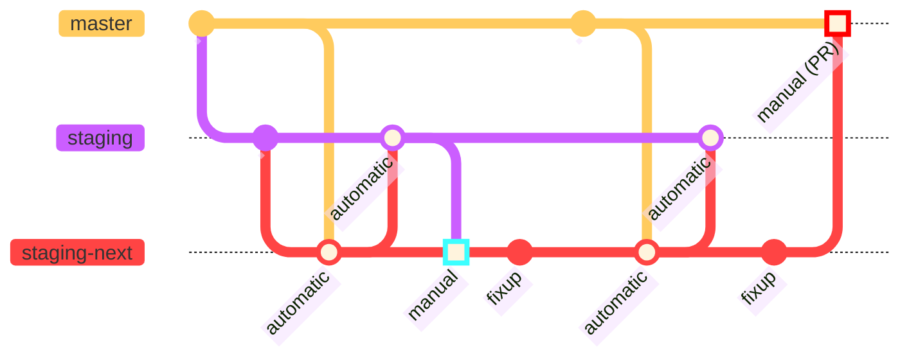

# Contributing to Nixpkgs

This document is for people wanting to contribute to Nixpkgs.
This involves changes that are proposed using [GitHub](https://github.com) [pull requests](https://docs.github.com/pull-requests) to the [Nixpkgs repository](https://github.com/nixos/nixpkgs).

A GitHub account is recommended, which you can sign up for [here](https://github.com/signup).
See [here](https://discourse.nixos.org/t/about-the-patches-category/477) for how to contribute without a GitHub account.

This document assumes that you already know how to use GitHub and Git.
If that's not the case, we recommend learning about it [here](https://docs.github.com/en/get-started/quickstart/hello-world).

## Overview
[overview]: #overview

This file contains general contributing information.
More specific information about individual parts of Nixpkgs can be found here:
- [`doc`](./doc/README.md): Sources and infrastructure for the [Nixpkgs manual](https://nixos.org/manual/nixpkgs/stable/)
- [`lib`](./lib/README.md): Sources and documentation of the [library functions](https://nixos.org/manual/nixpkgs/stable/#chap-functions)
- [`maintainers`](./maintainers/README.md): Nixpkgs maintainer and team listings, maintainer scripts
- [`nixos`](./nixos/README.md): Implementation of [NixOS](https://nixos.org/manual/nixos/stable/)
- [`pkgs`](./pkgs/README.md): Package and [builder](https://nixos.org/manual/nixpkgs/stable/#part-builders) definitions

# How to's

## How to create pull requests
[pr-create]: #how-to-create-pull-requests

This section describes how changes can be proposed with a pull request (PR).

> [!Note]
> Be aware that contributing implies licensing those contributions under the terms of [COPYING](./COPYING), an MIT-like license.

0. Set up a local version of Nixpkgs to work with:
   1. [Fork](https://docs.github.com/en/get-started/quickstart/fork-a-repo#forking-a-repository) the [Nixpkgs repository](https://github.com/nixos/nixpkgs).
   1. [Clone the forked repository](https://docs.github.com/en/get-started/quickstart/fork-a-repo#cloning-your-forked-repository) into a local `nixpkgs` directory.
   1. [Configure the upstream Nixpkgs repository](https://docs.github.com/en/get-started/quickstart/fork-a-repo#configuring-git-to-sync-your-fork-with-the-upstream-repository).

1. Select the appropriate [base branch](https://docs.github.com/en/pull-requests/collaborating-with-pull-requests/proposing-changes-to-your-work-with-pull-requests/about-branches#working-with-branches) for the change, as [described here][branch].
   If in doubt, use `master`.
   This can be changed later by [rebasing][rebase].

2. Create a new Git branch, ideally such that:
   - The name of the branch hints at your change, e.g. `update-hello`.
   - The branch contains the most recent base branch.

   We'll assume the base branch `master` here.

   ```bash
   # Make sure you have the latest changes from upstream Nixpkgs
   git fetch upstream

   # Create and switch to a new branch, based on the base branch in Nixpkgs
   git switch --create update-hello upstream/master
   ```

   To avoid potentially having to download and build many derivations, you can base on a specific [Git commit](https://www.git-scm.com/docs/gitglossary#def_commit) instead:
   - The commit of the latest `nixpkgs-unstable` channel, available [here](https://channels.nixos.org/nixpkgs-unstable/git-revision).
   - The commit of a local Nixpkgs downloaded using [nix-channel](https://nixos.org/manual/nix/stable/command-ref/nix-channel), available using `nix-instantiate --eval --expr '(import <nixpkgs/lib>).trivial.revisionWithDefault null'`
   - If you're using NixOS, the commit of your NixOS installation, available with `nixos-version --revision`.

   You can use this commit instead of `upstream/master` in the above command:
   ```bash
   # Here, b9c03fbb is an example commit from nixpkgs-unstable
   git switch --create update-hello b9c03fbb
   ```

3. Make your changes in the local Nixpkgs repository and:
   - Adhere to both the [general code conventions][code-conventions], and the relevant [specific code conventions][overview].
   - Test the changes.
   - If necessary, document the changes.

   See the [overview section][overview] for more specific information.

4. Commit your changes using `git commit`.
   Make sure to adhere to the [commit conventions](#commit-conventions).

   Repeat the steps 3-4 as many times as necessary.
   Advance to the next step once all the commits make sense together.
   You can view your commits with `git log`.

5. Push your commits to your fork of Nixpkgs:
   ```
   git push --set-upstream origin HEAD
   ```

   The above command will output a link to directly do the next step:
   ```
   remote: Create a pull request for 'update-hello' on GitHub by visiting:
   remote:      https://github.com/myUser/nixpkgs/pull/new/update-hello
   ```

6. [Create a pull request](https://docs.github.com/en/pull-requests/collaborating-with-pull-requests/proposing-changes-to-your-work-with-pull-requests/creating-a-pull-request#creating-the-pull-request) from the new branch in your Nixpkgs fork to the upstream Nixpkgs repository.
   Use the branch from step 1 as the PR's base branch.
   Go through the [pull request template][pr-template].

7. Respond to review comments and potentially to CI failures and merge conflicts by updating the PR.
   Always keep it in a mergeable state.

   The non-technical side of this process is covered in [I opened a PR, how do I get it merged?](#i-opened-a-pr-how-do-i-get-it-merged).

   The [ofborg](https://github.com/NixOS/ofborg) CI system will perform checks to ensure code quality.
   You can see the results at the bottom of the PR.
   See [the ofborg Readme](https://github.com/NixOS/ofborg#readme) for more details.

   - To add new commits, repeat steps 3-4 and push the result:
     ```
     git push
     ```

   - To change existing commits, [rewrite the Git history](https://git-scm.com/book/en/v2/Git-Tools-Rewriting-History).
     Useful Git commands for this are `git commit --patch --amend` and `git rebase --interactive`.
     With a rewritten history you need to force-push the commits:
     ```
     git push --force-with-lease
     ```

   - If there are merge conflicts, you will have to [rebase the branch](https://git-scm.com/book/en/v2/Git-Branching-Rebasing) onto the current **base branch**.
     Sometimes this can be done [on GitHub directly](https://docs.github.com/en/pull-requests/collaborating-with-pull-requests/proposing-changes-to-your-work-with-pull-requests/keeping-your-pull-request-in-sync-with-the-base-branch#updating-your-pull-request-branch).
     To rebase locally:
     ```
     git fetch upstream
     git rebase upstream/master
     git push --force-with-lease
     ```

     Use the base branch from step 1 instead of `upstream/master`.

   - If you need to change the base branch, [rebase][rebase].

8. If your PR is merged and [acceptable for releases][release-acceptable], you may [backport][pr-backport] it.

### Pull request template
[pr-template]: #pull-request-template

The pull request template helps to determine which steps have been taken so far.
Details not covered by the title and links to existing related issues should go at the top.

When a PR is created, it will be pre-populated with some checkboxes.

#### Tested using sandboxing

When sandbox builds are enabled, Nix will set up an isolated environment for each build process.
It is used to remove further hidden dependencies set by the build environment, to improve reproducibility.
This includes access to the network during the build outside of `fetch*` functions and files outside the Nix store.
Depending on the operating system, access to other resources is blocked as well; see [sandbox](https://nixos.org/manual/nix/stable/command-ref/conf-file#conf-sandbox) in the Nix manual for details.

Please test builds with sandboxing enabled, because it is also used in [Hydra](https://nixos.org/hydra).

If you are on Linux, sandboxing is enabled by default.
On other platforms, sandboxing is disabled by default due to a small performance hit on each build.

Please enable sandboxing **before** building the package by adding the following to `/etc/nix/nix.conf`:

  ```ini
  sandbox = true
  ```

#### Built on platform(s)

Many Nix packages are designed to run on multiple platforms.
As such, it’s important to let the maintainer know which platforms you have tested on.
It’s not always practical to test all platforms, and it’s not required for a pull request to be merged.
Only check the platforms you tested the build on in this section.

#### Tested via one or more NixOS test(s) if existing and applicable for the change (look inside nixos/tests)

Packages with automated tests are likely merged quicker, because they don’t require as much manual testing.
If there are existing tests for the package, they should be run.
NixOS tests can only be run on linux.
For more details on writing and running tests, see the [section in the NixOS manual](https://nixos.org/nixos/manual/index.html#sec-nixos-tests).

#### Tested compilation of all pkgs that depend on this change using `nixpkgs-review`

If you are modifying a package, you can use `nixpkgs-review` to make sure all packages that depend on the updated package still build.
It can work on uncommitted changes with the `wip` option or on a specific pull request.

Review changes from pull request number 12345:

```ShellSession
nix-shell -p nixpkgs-review --run "nixpkgs-review pr 12345"
```

Alternatively, with flakes (and analogously for the other commands below):

```ShellSession
nix run nixpkgs#nixpkgs-review -- pr 12345
```

Review uncommitted changes:

```ShellSession
nix-shell -p nixpkgs-review --run "nixpkgs-review wip"
```

Review changes from the last commit:

```ShellSession
nix-shell -p nixpkgs-review --run "nixpkgs-review rev HEAD"
```

#### Tested execution of all binary files (usually in `./result/bin/`)

It's important to test a modified package's executables.
Look into `./result/bin` and run all files in there, or at a minimum, the main executable.
For example, if you make a change to `texlive`, you probably would only check the binaries associated with the change you made, rather than testing all of them.

#### Meets Nixpkgs contribution standards

The last checkbox is about whether it fits the guidelines in this `CONTRIBUTING.md` file.
This document details our standards for commit messages, reviews, licensing of contributions, etc...
Everyone should read and understand these standards before submitting a pull request.

### Rebasing between branches (i.e. from `master` to `staging`)
[rebase]: #rebasing-between-branches-ie-from-master-to-staging

Sometimes, changes must be rebased between branches.
One example is, if the number of rebuilds caused is too large for the original target branch.

In the following example, the current `feature` branch is based on `master`, and we rebase it to have the PR target `staging`.
We rebase on the _merge base_ between `master` and `staging` to avoid too many local rebuilds.


```console
# Rebase your commits onto the common merge base
git rebase --onto upstream/staging... upstream/master
# Force push your changes
git push origin feature --force-with-lease
```

The syntax `upstream/staging...` is equivalent to `upstream/staging...HEAD` and stands for the merge base between `upstream/staging` and `HEAD` (hence between `upstream/staging` and `upstream/master`).

Then use the *Edit* button in the upper right corner of the GitHub PR, and switch the base branch from `master` to `staging`.
*After* the PR has been retargeted, a final rebase onto the target branch might be needed to resolve merge conflicts.

```console
# Rebase onto target branch
git rebase upstream/staging
# Review and fixup possible conflicts
git status
# Force push your changes
git push origin feature --force-with-lease
```

## How to backport pull requests
[pr-backport]: #how-to-backport-pull-requests

Once a PR has been merged, a backport to the corresponding `release-YY.MM` branch can be created.

### Automatically backporting changes

> [!Note]
> You have to be a [Nixpkgs maintainer](./maintainers) to automatically create a backport pull request.

Add the [`backport release-YY.MM` label](https://github.com/NixOS/nixpkgs/labels?q=backport) to the PR on the `master` branch.
This will cause [a GitHub Action](.github/workflows/backport.yml) to open a new PR to the `release-YY.MM` branch a few minutes later.
This can be done on both open or already merged pull requests.

### Manually backporting changes

To manually create a backport, follow [the standard pull request process][pr-create], but:

- Use `release-YY.MM` for the base branch, both for the local branch and the pull request.

> [!Warning]
> Do not use the `nixos-YY.MM` branch.
> It points to the latest _tested_ release channel commit.

- Instead of manually making and committing the changes, use [`git cherry-pick -x`](https://git-scm.com/docs/git-cherry-pick) for each commit.
  Use `git cherry-pick -x <commit>` when the reason is obvious, for example for minor version bumps and fixes.
  Otherwise, use `git cherry-pick -xe <commit>` to add a reason for the backport.
  Here is [an example](https://github.com/nixos/nixpkgs/commit/5688c39af5a6c5f3d646343443683da880eaefb8).

> [!Warning]
> Ensure the commits exist on the `master` branch.
> In the case of squashed or rebased merges, the commit hash will change and the new commits can be found in the merge message at the bottom of the `master` pull request.

- In the pull request description, link to the original pull request to `master`.
  The pull request title should include `[YY.MM]` matching the release you're backporting to.

## How to review pull requests
[pr-review]: #how-to-review-pull-requests

The Nixpkgs project receives a high number of pull requests.
Anyone may review and approve PRs and it is an important contribution to the project.

The high change rate makes any PR that remains open for too long subject to merge conflicts.
To avoid extra work, reviewing PRs timely and being responsive is key.
GitHub provides sort filters to see the [most recently updated](https://github.com/NixOS/nixpkgs/pulls?q=is%3Apr+is%3Aopen+sort%3Aupdated-desc) pull requests.
We highly encourage looking at [this list of ready to merge, unreviewed pull requests](https://github.com/NixOS/nixpkgs/pulls?q=is%3Apr+is%3Aopen+review%3Anone+status%3Asuccess+no%3Aproject+no%3Aassignee+no%3Amilestone).

Controversial changes can lead to controversial opinions, but it is important to respect every community member and their work.
Always be nice and polite.

GitHub provides reactions for quick feedback to pull requests or comments.
The thumb-down reaction should be used with care and, if possible, accompanied with explanation for the submitter to improve their contribution.

When doing a review:
- Aim to drive the proposal to a timely conclusion.
- Focus on the proposed changes and keep the scope narrow.
- Help the contributor prioritise their efforts towards getting their change merged.

If you find anything related that could be improved but is not immediately required for acceptance, consider:
- Implementing the changes yourself in a follow-up pull request,
- Tracking your idea in an issue,
- Offering to review a follow-up pull request,
- Making concrete [suggestions](https://docs.github.com/en/pull-requests/collaborating-with-pull-requests/reviewing-changes-in-pull-requests/incorporating-feedback-in-your-pull-request) in the same pull request.

For example, follow-up changes could involve refactoring code in the affected files.

But please remember not to make such additional considerations a blocker, and communicate that to the contributor, for example by following the [conventional comments](https://conventionalcomments.org) pattern.
If the related change is essential for the contribution at hand, make clear why you think it is important to address that first.

Pull request reviews should include a list of what has been reviewed in a comment, so other reviewers and mergers can know the state of the review.

All the review templates provided are generic examples.
Their usage is optional and the reviewer is free to adapt them.

To get more information about how to review specific parts of Nixpkgs, refer to the documents linked to in the [overview section][overview].

If a pull request contains documentation changes that might require feedback from the documentation team, ping [@NixOS/documentation-team](https://github.com/orgs/nixos/teams/documentation-team) on the pull request.

If you have enough knowledge and experience in a topic and would like to be a long-term reviewer for related submissions, please contact the current reviewers for that topic.
The main reviewers for a topic can be hard to find as there is no list, but checking past pull requests or git-blaming the code can give some hints.

## How to merge pull requests yourself
[pr-merge]: #how-to-merge-pull-requests

You can invoke the nixpkgs-merge-bot by commenting `@NixOS/nixpkgs-merge-bot merge`.
The bot will verify the following conditions, refusing to merge otherwise:

- the PR author should be @r-ryantm or a Nixpkgs committer;
- the invoker should be among the package maintainers;
- the package should reside in `pkgs/by-name`.

Further, nixpkgs-merge-bot will ensure all CI checks and the ofborg builds for Linux have successfully completed before merging the pull request.
Should the checks still be underway, the bot will wait for them to finish before attempting the merge again.

For other pull requests, please see [I opened a PR, how do I get it merged?](#i-opened-a-pr-how-do-i-get-it-merged).

In case the PR is stuck waiting for the author to apply a trivial change and the author allowed members to modify the PR, consider applying it yourself.
You should pay extra attention to make sure the addition doesn't go against the idea of the original PR and would not be opposed by the author.

Please see the discussion in [GitHub nixpkgs issue #321665](https://github.com/NixOS/nixpkgs/issues/321665) for information on how to proceed to be granted this level of access.

As a maintainer, when you leave the Nix community, please create an issue or post on [Discourse](https://discourse.nixos.org) with references to the packages and modules you maintained, so they can be taken over by other contributors.

# Flow of merged pull requests

After a pull request is merged, it eventually makes it to [Hydra](https://hydra.nixos.org).
Hydra regularly evaluates and builds Nixpkgs, updating [the official channels](https://channels.nixos.org) when their jobs succeed.
See [Nix Channel Status](https://status.nixos.org) for the current channel states.

Our primary development branches and their related channels are:

- `master`: The main branch, used for the unstable channels `nixos-unstable`, `nixos-unstable-small` and `nixpkgs-unstable`.
- `release-YY.MM`: The release branches, used for the stable channels `nixos-YY.MM`, `nixos-YY.MM-small` and `nixpkgs-YY.MM-darwin`.

When a channel is updated, its corresponding branch is also updated to the same commit.
Example: The [`nixpkgs-unstable` branch](https://github.com/nixos/nixpkgs/tree/nixpkgs-unstable) corresponds to the commit from the [`nixpkgs-unstable` channel](https://channels.nixos.org/nixpkgs-unstable).

Nixpkgs is tied to the NixOS release process, which is documented in the [NixOS Release Wiki](https://nixos.github.io/release-wiki/).

See [this section][branch] to know when to use the release branches.

## Staging
[staging]: #staging

The staging workflow exists to batch Hydra builds of many packages together.
It is coordinated in the [Staging room](https://matrix.to/#/#staging:nixos.org) on Matrix.

It works by directing commits that cause [mass rebuilds][mass-rebuild] to a separate `staging` branch that isn't directly built by Hydra.
Regularly, the `staging` branch is _manually_ merged into a `staging-next` branch to be built by Hydra using the [`nixpkgs:staging-next` jobset](https://hydra.nixos.org/jobset/nixpkgs/staging-next).
The `staging-next` branch should then only receive changes that fix Hydra builds; **for anything else, ask the [Staging room](https://matrix.to/#/#staging:nixos.org) first**.
Once it is verified that there are no major regressions, `staging-next` is merged into `master` using [a pull request](https://github.com/NixOS/nixpkgs/issues?q=label%3A%224.workflow%3A+staging%22).
This is done manually to ensure it's a good use of Hydra's computing resources.
Since `staging-next` is separate from `staging`, you may merge changes into `staging` at any time.

In order for the `staging` and `staging-next` branches to be up-to-date with the latest commits on `master`, there are regular _automated_ merges from `master` into `staging-next`, and from `staging-next` into `staging`.
This is implemented using GitHub workflows [here](.github/workflows/periodic-merge-6h.yml) and [here](.github/workflows/periodic-merge-24h.yml).

> [!Note]
> Changes must be well tested before being merged into any branch.
> Hydra builds should not be used as a testing platform.

Here is a Git history diagram showing the flow of commits between the three branches:



Here's an overview of the different branches:

| branch | `master` | `staging-next` | `staging` | [`staging-nixos`][test-driver-rebuild] |
| --- | --- | --- | --- | --- |
| Used for development | ✔️ | ❌ | ✔️ | ✔️ |
| Built by Hydra | ✔️ | ✔️ | ❌ | ❌ |
| [Mass rebuilds][mass-rebuild] | ❌ | ⚠️  Only to fix Hydra builds | ✔️ | ❌[^1]  |
| Critical security fixes | ✔️ for non-mass-rebuilds | ✔️ for mass-rebuilds | ❌ | ✔️ |
| Automatically merged into | `staging-next` & `staging-nixos` | `staging` | - | - |
| Manually merged into | - | `master` | `staging-next` | `master` |

The staging workflow is used for all stable branches with corresponding names:
- `master`/`release-YY.MM`
- `staging`/`staging-YY.MM`
- `staging-next`/`staging-next-YY.MM`

[^1]: Except changes that cause no more rebuilds than kernel updates

# Conventions

## Branch conventions
<!-- This section is relevant to both contributors and reviewers -->
[branch]: #branch-conventions

Most changes should go to `master`, but sometimes other branches should be used instead.
Use the following decision process to figure out the right branch:

Is the change [acceptable for releases][release-acceptable] and do you wish to have the change in the release?
- No: Use the `master` branch, do not backport the pull request.
- Yes: Can the change be implemented the same way on the `master` and release branches?
  For example, a package's major version might differ between the `master` and release branches, such that separate security patches are required.
  - Yes: Use the `master` branch and [backport the pull request](#how-to-backport-pull-requests).
  - No: Create separate pull requests to the `master` and `release-YY.MM` branches.

If the change causes a [mass rebuild][mass-rebuild], use the `staging` branch instead:
- Mass rebuilds to `master` should go to `staging` instead.
- Mass rebuilds to `release-YY.MM` should go to `staging-YY.MM` instead.

See [this section][staging] for how such changes propagate between the branches.

### Changes acceptable for releases
[release-acceptable]: #changes-acceptable-for-releases

Only changes to _supported_ releases may be accepted.
The oldest supported release (`YYMM`) can be found using
```
nix-instantiate --eval -A lib.trivial.oldestSupportedRelease
```

The release branches should generally only receive backwards-compatible changes, both for the Nix expressions and derivations.
Here are some examples of changes that are okay to backport:
- ✔️ New packages, modules and functions
- ✔️ Security fixes
- ✔️ Package version updates
  - ✔️ Patch versions with fixes
  - ✔️ Minor versions with new functionality, but no breaking changes

In addition, major package version updates with breaking changes are also acceptable for:
- ✔️ Services that would fail without up-to-date client software, such as `spotify`, `steam`, and `discord`
- ✔️ Security critical applications, such as `firefox` and `chromium`

### Changes causing mass rebuilds
[mass-rebuild]: #changes-causing-mass-rebuilds

Which changes cause mass rebuilds is not formally defined.
In order to help the decision, CI automatically assigns [`rebuild` labels](https://github.com/NixOS/nixpkgs/labels?q=rebuild) to pull requests based on the number of packages they cause rebuilds for.
As a rule of thumb, if the number of rebuilds is **500 or more**, consider targeting the `staging` branch instead of `master`; if the number is **1000 or more**, the pull request causes a mass rebuild, and should target the `staging` branch.
See [previously merged pull requests to the staging branches](https://github.com/NixOS/nixpkgs/issues?q=base%3Astaging+-base%3Astaging-next+is%3Amerged) to get a sense for what changes are considered mass rebuilds.

Please note that changes to the Linux kernel are an exception to this rule.
These PRs go to `staging-nixos`, see [the next section for more context](#changes-rebuilding-all-tests).

### Changes rebuilding all NixOS tests
[test-driver-rebuild]: #changes-rebuilding-all-nixos-tests

Changes causing a rebuild of all NixOS tests get a special [`10.rebuild-nixos-tests`](https://github.com/NixOS/nixpkgs/issues?q=state%3Aopen%20label%3A10.rebuild-nixos-tests) label.
These changes pose a significant impact on the build infrastructure.

Hence, these PRs should either target a `staging`-branch or `staging-nixos`, provided one of following conditions applies:

* The label `10.rebuild-nixos-tests` is set, or
* The PR is a change affecting the Linux kernel.

The branch gets merged whenever mainline kernel updates or critical security fixes land on the branch.
This usually happens on a weekly basis.

Backports are not handled by such a branch.
The relevant PRs from this branch must be backported manually.

## Commit conventions
[commit-conventions]: #commit-conventions

- Create one commit for each logical unit.

- If you have commits `pkg-name: oh, forgot to insert whitespace`: squash commits in this case.
  Use `git rebase -i`.
  See [Squashing Commits](https://git-scm.com/book/en/v2/Git-Tools-Rewriting-History#_squashing) for additional information.

- For consistency, there should not be a period at the end of the commit message's summary line (the first line of the commit message).

- When adding yourself to `maintainer-list.nix`, make a separate commit with the message `maintainers: add <handle>`.
  Add the commit before those making changes to the package or module.
  See [Nixpkgs Maintainers](./maintainers/README.md) for details.

- Make sure you read about any commit conventions specific to the area you're touching.
  See:
  - [Commit conventions](./doc/README.md#commit-conventions) for changes to `doc`, the Nixpkgs manual.
  - [Commit conventions](./lib/README.md#commit-conventions) for changes to `lib`.
  - [Commit conventions](./nixos/README.md#commit-conventions) for changes to `nixos`.
  - [Commit conventions](./pkgs/README.md#commit-conventions) for changes to `pkgs`.

### Writing good commit messages
[writing-good-commit-messages]: #writing-good-commit-messages

It's important to include relevant information in the *commit message*, so others can later understand *why* a change was made.
While this potentially can be understood by reading code, PR discussion or upstream changes, doing so often requires a lot of work.

Simple package version updates need to include the attribute name, old and new versions, as well as a reference to the release notes or changelog.
Package upgrades with more extensive changes require more verbose commit messages.

## Review and Merge conventions

Comments on Pull Requests are considered non-blocking by default.
Every blocking comment must be explicitly marked as such by using GitHub's "Request Changes" review type.
A reviewer who submits a blocking review should be available for discussion and re-review.
An abandoned review may be dismissed after reasonable time was given at the discretion of the merger.

All suggestions for change, blocking or not, should be acknowledged before merge.
This can happen implicitly by applying the suggestion, or explicitly by rejecting it.

To make changes on commit structure and commit messages or apply simple suggestions, committers are encouraged to [checkout the PR](https://cli.github.com/manual/gh_pr_checkout) and push directly to the contributor's branch before merging.
Committers will carefully weigh the cost of another review cycle against the feelings of the contributor when pushing to their branch.
They should also transparently communicate which changes they made.
If a contributor does not want committers to push to their branch, they must uncheck the "Allow edits and access to secrets by maintainers" box explicitly.

> [!WARNING]
> Committers: Branches created via `gh pr checkout` can't be pushed with `--force-with-lease`, so do a sanity check before pushing.

## Code conventions
[code-conventions]: #code-conventions

### Release notes

If you removed packages or made some major NixOS changes, write about it in the next release notes in [`nixos/doc/manual/release-notes`](./nixos/doc/manual/release-notes).

### File naming and organisation

Names of files and directories should be in lowercase, with dashes between words — kebab case, not camel case.
For instance, it should be `all-packages.nix`, not `allPackages.nix` or `AllPackages.nix`.

### Formatting

CI [enforces](./.github/workflows/lint.yml) all Nix files to be formatted using the [official Nix formatter](https://github.com/NixOS/nixfmt).

You can ensure this locally using either of these commands:
```
nix-shell --run treefmt
nix develop --command treefmt
nix fmt
```

If you're starting your editor in `nix-shell` or `nix develop`, you can also set it up to automatically run `treefmt` on save.

If you have any problems with formatting, please ping the [formatting team](https://nixos.org/community/teams/formatting/) via [@NixOS/nix-formatting](https://github.com/orgs/NixOS/teams/nix-formatting).

### Syntax

- Set up [editorconfig](https://editorconfig.org) for your editor, such that [the settings](./.editorconfig) are automatically applied.

- Use `lowerCamelCase` for variable names, not `UpperCamelCase`.
  Note, this rule does not apply to package attribute names, which instead follow the rules in [package naming](./pkgs/README.md#package-naming).

- Functions should list their expected arguments as precisely as possible.
  That is, write

  ```nix
  {
    stdenv,
    fetchurl,
    perl,
  }:
  <...>
  ```

  instead of

  ```nix
  args: with args; <...>
  ```

  or

  ```nix
  {
    stdenv,
    fetchurl,
    perl,
    ...
  }:
  <...>
  ```

  For functions that are truly generic in the number of arguments, but have some required arguments, you should write them using an `@`-pattern:

  ```nix
  {
    stdenv,
    doCoverageAnalysis ? false,
    ...
  }@args:

  stdenv.mkDerivation (args // { foo = if doCoverageAnalysis then "bla" else ""; })
  ```

  instead of

  ```nix
  args:

  args.stdenv.mkDerivation (
    args
    // {
      foo = if args ? doCoverageAnalysis && args.doCoverageAnalysis then "bla" else "";
    }
  )
  ```

- Unnecessary string conversions should be avoided.
  Do

  ```nix
  { rev = version; }
  ```

  instead of

  ```nix
  { rev = "${version}"; }
  ```

- Building lists conditionally _should_ be done with `lib.optional(s)` instead of using `if cond then [ ... ] else null` or `if cond then [ ... ] else [ ]`.

  ```nix
  { buildInputs = lib.optional stdenv.hostPlatform.isDarwin iconv; }
  ```

  instead of

  ```nix
  { buildInputs = if stdenv.hostPlatform.isDarwin then [ iconv ] else null; }
  ```

  As an exception, an explicit conditional expression with null can be used when fixing a important bug without triggering a mass rebuild.
  If this is done a follow up pull request _should_ be created to change the code to `lib.optional(s)`.

- Any style choices not covered here but that can be expressed as general rules should be left at the discretion of the authors of changes and _not_ commented in reviews.
  The purpose of this is:
   - to avoid churn as contributors with different style preferences undo each other's changes,
   - to ensure that style rules are written down and consistent (and can thus be followed when authoring changes, reducing review cycles),
   - and to encourage reviews to focus on more impactful considerations.

# Practical contributing advice

To contribute effectively and efficiently, you need to be aware of how the process generally works.
This section aims to document the process as we live it in Nixpkgs to set the right expectations and give practical tips on how to work with it.

## I opened a PR, how do I get it merged?
[i-opened-a-pr-how-do-i-get-it-merged]:#i-opened-a-pr-how-do-i-get-it-merged

In order for your PR to be merged, a committer needs to review and merge it.
Because committers are mostly independent, unpaid volunteers, this can take time.
It is entirely normal for your PR to sit around without any feedback for days, weeks or sometimes even months.
We strive to avoid this, but the reality is that it happens frequently.
Even when you get feedback, follow-ups may take just as long.
Don't be intimidated and kindly ask for feedback again every so often.
If your change is good, it will eventually be merged.

You can often speed up the process by understanding the committer's perspective and preparing your PR with reviewing in mind.

### The committer's perspective

PRs have varying quality and even the best people make mistakes.
Committers need to assess whether a PR's changes are good or not.
To merge, at least one committer has to be confident about its quality.

Committers typically assess three aspects:

1. Whether the change's intention is necessary and desirable.
2. Whether the code quality of your changes is good.
3. Whether the produced artifacts are good.

To get your PR merged quickly and smoothly, you should help convince committers in these aspects.

### How to help committers assess your PR

It's best to explain *why* you've made your change, because guessing the intention is not always possible.
This does not apply to trivial changes like version updates, because the intention is obvious.
For more nuanced changes or even major version upgrades, it helps if you explain the background behind your change.
For example, if you're adding a package, explain what it is and why it should be in Nixpkgs.
This goes hand in hand with [Writing good commit messages](#writing-good-commit-messages).

To show the quality of your code, you should focus on making it *reviewable*.
First, take a look at your code changes yourself and try to put yourself into the shoes of someone who didn't just write that code.
Would you immediately know what the code does or why it is needed by glancing at it?
If not, reviewers will notice this and will ask you to clarify the code by refactoring it and/or adding code comments.
Doing this preemptively can save a lot of time.
Doing multiple unrelated changes in a single commit can become hard to review quickly.
Thus, consider multiple atomic commits to tell the story of your change.
There is a balance to strike however: over-fragmentation causes friction.

The artifacts are the hardest to assess because PRs touch all sorts of components: applications, libraries, NixOS modules, editor plugins and many other things.
Any individual committer can only really assess components that they themselves know how to use.
Yet, they must still be convinced somehow.
There isn't a good generic solution to this but there are some ways to ease it:

- Provide smoke tests that can be run without much research or setup.

  Committers usually don't have the time or interest to learn how your component works and how they could test its functionality.
  Try to provide a quick guide on how to use it in a meaningful way or a ready-made command that demonstrates that it works as expected.
  The committer can use this to convince themselves that your change is good.
  If it can be automated, you could even turn this into an automated NixOS test which reviewers could simply run.

- Invite other users of the component to try it out and report their findings.

  Seeing other users testing the changes and having it work for them can convince committers, too.

- Describe what you have done to test your PR.

  It also helps, if you can additionally show that you have done sufficient quality assurance on your changes.

- Become a maintainer of the component.

  Listed maintainers generally receive more trust when it comes to changes to their maintained components.

Even if you adhere to all of these recommendations, it is still quite possible for your PR to be forgotten or abandoned by any given committer.
Please remain mindful of them doing this work on their own volition and unpaid in their free time and therefore [owing you nothing](https://mikemcquaid.com/open-source-maintainers-owe-you-nothing/).
Causing a stink in such a situation is a surefire way to get any other potential committer to not want to look at your PR either.
Ask them nicely whether they still intend to review your PR and find yourself another committer to look at your PR if not.

### How can I get a committer to look at my PR?

- Improve skimmability: use a simple descriptive PR title outlining _what_ is done and _why_.
  Details go in commit messages.
- Improve discoverability: apply all relevant labels, tick all relevant PR body checkboxes.
- Wait.
  Reviewers frequently browse open PRs and may happen to run across yours and take a look.
- Get non-committers to review/approve.
  Many committers filter open PRs for low-hanging fruit that have already been reviewed.
- [@-mention](https://github.blog/news-insights/mention-somebody-they-re-notified/) someone and ask them nicely.
- Post in one of the channels made for this purpose if there has been no activity for at least one week:
  - The current "PRs ready for review" or "PRs already reviewed" threads in the [NixOS Discourse](https://discourse.nixos.org/c/dev/14).
  - The [Nixpkgs Review Requests Matrix room](https://matrix.to/#/#review-requests:nixos.org).
  - Similar threads/rooms in unofficial NixOS spaces, such as Discord.

### CI failed or got stuck on my PR, what do I do?

First, ensure that the failure is actually related to your change.
Sometimes, the CI system simply has a hiccup or the check was broken by someone else before.
Read through the error message; it's usually quite easy to tell whether it is caused by changes to the component you touched.
If it is indeed caused by your change, try to fix it.
Don't be afraid of asking for advice if you're uncertain how to do that, others might have fixed such issues already and can help you out.
Your PR will not be merged while CI is still failing.

ofborg builds can often get stuck, particularly in PRs targeting `staging` and in builders for the Darwin platform.
Reviewers will know how to handle them or when to ignore them.
Don't worry about it.
However, if there is a build failure and it was caused by your change, you need to investigate it.
If ofborg reveals the build to be broken on a platform that you don't have access to, consider setting your package's `meta.broken`, `meta.badPlatforms` or `meta.platforms` accordingly.

When in any doubt, please ask via comments or through one of the help channels.

## I received a review, how do I get it over the finish line?

Most likely, a reviewer wants you to change a few things or requires further input.

A reviewer may have taken a look at the code and it looked good to them ("Diff LGTM"), but they still need to be convinced of the artifact's quality.
They might also be waiting on input from other users or maintainers on whether the intention and direction of your PR makes sense.
If you know of people who could help clarify any of this, please bring the PR to their attention.
The current state of the PR is frequently not clearly communicated, so please don't hesitate to ask about it if it's unclear to you.

It's also possible for the reviewer to not be convinced that your PR is necessary or that the method you've chosen is the right one.

Please explain your intentions and reasoning to the committer in such a case.
There may be constraints you had to work with which they're not aware of or qualities of your approach that they didn't immediately notice.
If these weren't clear to the reviewer, that's a good sign you should explain them in your commit message or code comments!

There are some further pitfalls and realities to be aware of:

### Aim to reduce cycles

Be prepared for it to take a while for the reviewer to get back to you after you respond.
This is simply the reality of projects at the scale of Nixpkgs.
As such, make sure to respond to _all_ feedback at once.
It wastes everyone's time to wait for a couple of days just to have the reviewer need to remind you to address something they asked for.

### A reviewer requested a bunch of insubstantial changes

The people involved in Nixpkgs care about code quality.
Once in Nixpkgs, the code needs to be maintained for many years to come.
Therefore, you will likely be asked to do something different or adhere to a standard.

Sometimes however, they also care a bit too much and may ask you to adhere to a personal preference of theirs.
It's not always easy to tell whether or not the requested changes must be addressed.
Sometimes, another reviewer may even have a _conflicting_ opinion on some points.

It is convention to mark review comments that are not required to merge as nitpicks, but this is not always followed.
As the author, you should still take a look at these, as they will often reveal best practices and unwritten rules.
Those usually have good reasons behind them and you may want to pick them up as well.

Please keep in mind that reviewers always mean well.
Their intent is not to denounce your code, they want your code to be as good as it can be.
Through their experience, they may also take notice of a seemingly insignificant issue that has caused problems before.

Sometimes however, they can also get a bit carried away and become too perfectionistic.
If you feel some of the requests are unreasonable, out of scope, or merely a matter of personal preference, try to nicely ask the reviewers whether these requests are *critical* to the PR's success.

While we do have a set of [official standards for the Nix community](https://github.com/NixOS/rfcs), we don't have standards for everything and there are often multiple valid ways to achieve the same goal.
Unless there are standards forbidding the patterns used in your code or there are serious technical, maintainability or readability issues with your code, you can disregard these requests.
Please communicate this clearly though; a simple "I prefer it this way and see no major issue maintaining it" can save a lot of arguing.

If you are unsure about some change requests, please ask reviewers *why* they requested them.
This will usually reveal how important they deem it to be and will help educate you about standards, best practices, unwritten rules as well as preferences people have and why.

Some committers have stronger opinions on some things and may not want to merge your PR if you don't follow their requests.
It is totally fine to get yourself a second or third opinion in such a case.

### Committers work on a push-basis

It's possible for you to get a review but nothing happens afterwards, even if you respond to review comments.
A committer not following up on your PR does not necessarily mean they're disinterested, they may have simply had other circumstances preventing them from doing so.

Committers typically handle many PRs at the same time and it is not realistic for them to keep up with all of them immediately.
If someone approved and didn't merge a few days later, they most likely just forgot.

Please see it as your responsibility to actively remind reviewers of your open PRs.

The easiest way to do so is to notify them via GitHub.
Github notifies people involved, whenever you add a comment or push to your PR or re-request their review.
Doing any of that will get their attention again.
Everyone deserves proper attention, and yes, that includes you!
However, please be mindful that committers can sadly not always give everyone the attention they deserve.

It may very well be the case that you have to do this every time you need the committer to follow up upon your PR.
Again, this is a community project so please be mindful of people's circumstances here; be nice when requesting reviews again.

It may also be the case that the committer has lost interest or isn't familiar enough with the component you're touching to be comfortable to merge.
They will likely not immediately state that fact, so please ask for clarification and don't hesitate to find yourself another committer to take a look.

### Nothing helped

If you followed these guidelines but still got no results or if you feel that you have been wronged, please explicitly reach out to the greater community.

The [NixOS Discourse](https://discourse.nixos.org) is a great place to do this, as it has historically been the asynchronous medium with the greatest concentration of committers and other people who are involved in Nixpkgs.
There is a dedicated discourse thread [PRs in distress](https://discourse.nixos.org/t/prs-in-distress/3604) where you can link your PR, if everything else fails.
The [Nixpkgs / NixOS contributions Matrix channel](https://matrix.to/#/#dev:nixos.org) is the best synchronous channel with the same qualities.

Please reserve these for cases where you've made a serious effort in trying to get the attention of multiple active committers and provided realistic means for them to assess your PR's quality.
As mentioned previously, it is unfortunately perfectly normal for a PR to sit around for weeks.

Please don't blow up situations where progress is happening but is merely not going fast enough for your tastes.
Honking in a traffic jam will not make you go any faster.
