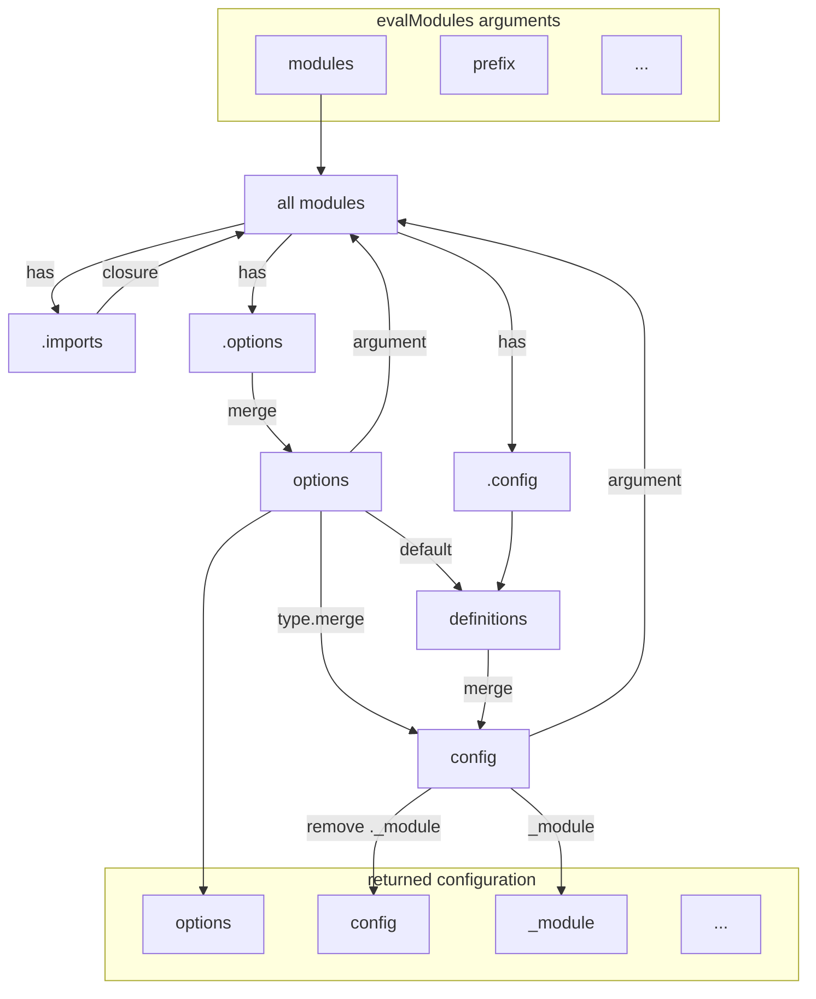

# Module System {#module-system}

::: {.note}
This chapter is new and not complete yet. For a gentle introduction to the module system, in the context of NixOS, see [Writing NixOS Modules](https://nixos.org/manual/nixos/unstable/index.html#sec-writing-modules) in the NixOS manual.
:::

## Introduction {#module-system-introduction}

The module system is a language for handling configuration, implemented as a Nix library.

It was historically known as the NixOS module system.

Its purpose is to "extend" the Nix language with

- **dynamic type checking** to find mistakes early on, improving error messages;
- **documentation**, so that each option has a description, conveniently located in the file that declares it
- **modularity** or **aspect oriented programming**: separate files can all contribute to the same option.

The following sections are dense introductory reference material.

<!-- TODO: link the tutorial
   If you're learning to work with the module system, consider following the introductory tutorial to get a feel for the module system. -->

## Concepts {#module-system-concepts}

The following sections briefly define the concepts that make up the module system.

<!-- keep them short -->

### Module Evaluation {#module-system-concept-evaluation}

<!-- NOTE: this is an introductory section. It is not meant to be a complete reference -->

Module evaluation is the process of turning a set of modules into option values.

The module system can be seen as an embedded domain specific language (eDSL) for configuration. The defining feature of an eDSL is that they are evaluated by a host language, which in this case is the Nix expression language. So _module evaluation_ is implemented using Nix evaluation, by means of the [`evalModules`] function.

### Configuration {#module-system-concept-configuration}

<!-- NOTE: this is an introductory section. It is not meant to be a complete reference -->

A configuration is the result of [module evaluation](#module-system-concept-evaluation).

It consists of a set of options. Each option is identified by an [attribute path], and may produce a single value (which may in turn be a composite value such as an attribute set).

The module system provides its caller with _all_ the options and their values. It is up to the [application] to assign meaning to the options and to pick options (typically one option) that represents the value of the entire configuration.

### Module {#module-system-concept-module}

<!-- NOTE: this is an introductory section. It is not meant to be a complete reference -->

A module is a function that produces part of the configuration.

A module can be written using multiple, similar [syntaxes](#module-syntax), which are converted internally to the most general syntax, which is a function that returns an attribute set with specific attribute names.

These attributes, the [module attributes] are then processed in order to produce the [module arguments], which are passed to the modules.

As you can see, module system evaluation is a cyclic process. This works thanks to Nix's lazy evaluation.

### Data flow {#module-system-data-flow}

<!-- NOTE: this is an introductory section. It is not meant to be a complete reference -->

The following diagram shows the data flows that occur within a module system evaluation.

Multiplicity is not modeled. For example `.options -> options` is a many-to-many transformation where any option declaration can affect any option.

### Module syntax {#module-syntax}

<!-- NOTE: this is an introductory section. It is not meant to be a complete reference -->

A module can be specified as an attribute set or a function.
The attribute set may be in canonical or shorthand form.

<!-- TODO elaboration, examples -->

<!-- TODO refer to complete reference doc -->

### Option declaration

<!-- NOTE: this is an introductory section. It is not meant to be a complete reference -->

For a [configuration] to be useful, its modules must declare options, a [freeformType] or both.

Options are declared by adding the return value of [mkOption] to attribute paths in the [options](#module-attr-options).

Advanced: like the value of an option, the option itself will be merged when multiple declarations are present at the same option path.

<!-- TODO refer to complete reference doc -->

### Config definitions

<!-- NOTE: this is an introductory section. It is not meant to be a complete reference -->

Each module can define values for the options it chooses to. This means that multiple definitions may exist simultaneously. The definitions are merged together according to the option declaration attributes, and notably the [option type].

TBD:
- laziness and `mkIf` / `pushDownProperties`

<!-- TODO refer to complete reference doc -->

### Option type

<!-- NOTE: this is an introductory section. It is not meant to be a complete reference -->

An option type defines the condition under which a definition is valid, and it specifies how to merge definitions, if at all possible.

TBD:
- `.check` method is shallow
- `.merge` is responsible for extra checking
- link to the standard types
- option types can be composed from option types.
  - they're still called option types even if they're not a the root of an option

<!-- TODO refer to complete reference doc -->

### Submodules

<!-- NOTE: this is an introductory section. It is not meant to be a complete reference -->

A submodule is a [configuration] inside a [configuration].

While options are already contained within a hierarchy of composition, by virtue of option declarations having an attribute path rather than a single attribute, this type of composition is limited to attributes with a fixed name.

`types.attrsOf` on the other hand does allow definitions with arbitrary attribute names, but does not - by itself - declare an option structure with such arbitrary attributes. This is the role of the submodule [option type].

Furthermore, a submodule can be used without `attrsOf` or `listOf` to add a [freeformType] at and below a certain option path.

<!-- TODO refer to complete reference doc -->

### freeformType

<!-- NOTE: this is an introductory section. It is not meant to be a complete reference -->

No need to declare all possible options

TBD
- attributes
- mention RFC 42, as people still throw that around

### Option path

<!-- NOTE: this is an introductory section. It is not meant to be a complete reference -->

The attribute path that leads to an option declaration.
This is only defined within the context of a single [configuration] and does not extend through [submodules] or `types.attrsOf`. See [location].

### Location

<!-- NOTE: this is an introductory section. It is not meant to be a complete reference -->

The path to a declaration or definition. Unlike an option path, this traverses type boundaries, resulting in a descriptive path that includes the initial option path, [attrsOf] names, and option paths within [submodules].

### Definition modifiers(?)

<!-- NOTE: this is an introductory section. It is not meant to be a complete reference -->

`mkIf`, `mkAfter`, `mkForce`, etc.

## `lib.evalModules` {#module-system-lib-evalModules}

Evaluate a set of modules. This function is typically only used once per application (e.g. once in NixOS, once in Home Manager, ...).

### Parameters {#module-system-lib-evalModules-parameters}

#### `modules` {#module-system-lib-evalModules-param-modules}

A list of modules. These are merged together to form the final configuration.
<!-- TODO link to section about merging, TBD -->

#### `specialArgs` {#module-system-lib-evalModules-param-specialArgs}

An attribute set of module arguments that can be used in `imports`.

This is in contrast to `config._module.args`, which is only available after all `imports` have been resolved.

#### `class` {#module-system-lib-evalModules-param-class}

If the `class` attribute is set and non-`null`, the module system will reject `imports` with a different `_class` declaration.

The `class` value should be a string in lower [camel case](https://en.wikipedia.org/wiki/Camel_case).

If applicable, the `class` should match the "prefix" of the attributes used in (experimental) [flakes](https://nixos.org/manual/nix/stable/command-ref/new-cli/nix3-flake.html#description). Some examples are:

 - `nixos` as in `flake.nixosModules`
 - `nixosTest`: modules that constitute a [NixOS VM test](https://nixos.org/manual/nixos/stable/index.html#sec-nixos-tests)
<!-- We've only just started with `class`. You're invited to add a few more. -->

#### `prefix` {#module-system-lib-evalModules-param-prefix}

A list of strings representing the location at or below which all options are evaluated. This is used by `types.submodule` to improve error reporting and find the implicit `name` module argument.

### Return value {#module-system-lib-evalModules-return-value}

The result is an attribute set with the following attributes:

#### `options` {#module-system-lib-evalModules-return-value-options}

The nested attribute set of all option declarations.

#### `config` {#module-system-lib-evalModules-return-value-config}

The nested attribute set of all option values.

#### `type` {#module-system-lib-evalModules-return-value-type}

A module system type. This type is an instance of `types.submoduleWith` containing the current [`modules`](#module-system-lib-evalModules-param-modules).

The option definitions that are typed with this type will extend the current set of modules, like [`extendModules`](#module-system-lib-evalModules-return-value-extendModules).

However, the value returned from the type is just the [`config`](#module-system-lib-evalModules-return-value-config), like any submodule.

If you're familiar with prototype inheritance, you can think of this `evalModules` invocation as the prototype, and usages of this type as the instances.

This type is also available to the [`modules`](#module-system-lib-evalModules-param-modules) as the module argument `moduleType`.
<!-- TODO: document the module arguments. Using moduleType is like saying: suppose this configuration was extended. -->

#### `extendModules` {#module-system-lib-evalModules-return-value-extendModules}

A function similar to `evalModules` but building on top of the already passed [`modules`](#module-system-lib-evalModules-param-modules). Its arguments, `modules` and `specialArgs` are added to the existing values.

If you're familiar with prototype inheritance, you can think of the current, actual `evalModules` invocation as the prototype, and the return value of `extendModules` as the instance.

This functionality is also available to modules as the `extendModules` module argument.

::: {.note}

**Evaluation Performance**

`extendModules` returns a configuration that shares very little with the original `evalModules` invocation, because the module arguments may be different.

So if you have a configuration that has been (or will be) largely evaluated, almost none of the computation is shared with the configuration returned by `extendModules`.

The real work of module evaluation happens while computing the values in `config` and `options`, so multiple invocations of `extendModules` have a particularly small cost, as long as only the final `config` and `options` are evaluated.

If you do reference multiple `config` (or `options`) from before and after `extendModules`, evaluation performance is the same as with multiple `evalModules` invocations, because the new modules' ability to override existing configuration fundamentally requires constructing a new `config` and `options` fixpoint.
:::

#### `_module` {#module-system-lib-evalModules-return-value-_module}

A portion of the configuration tree which is elided from `config`.

<!-- TODO: when markdown migration is complete, make _module docs visible again and reference _module docs. Maybe move those docs into this chapter? -->

#### `_type` {#module-system-lib-evalModules-return-value-_type}

A nominal type marker, always `"configuration"`.

#### `class` {#module-system-lib-evalModules-return-value-_configurationClass}

The [`class` argument](#module-system-lib-evalModules-param-class).
