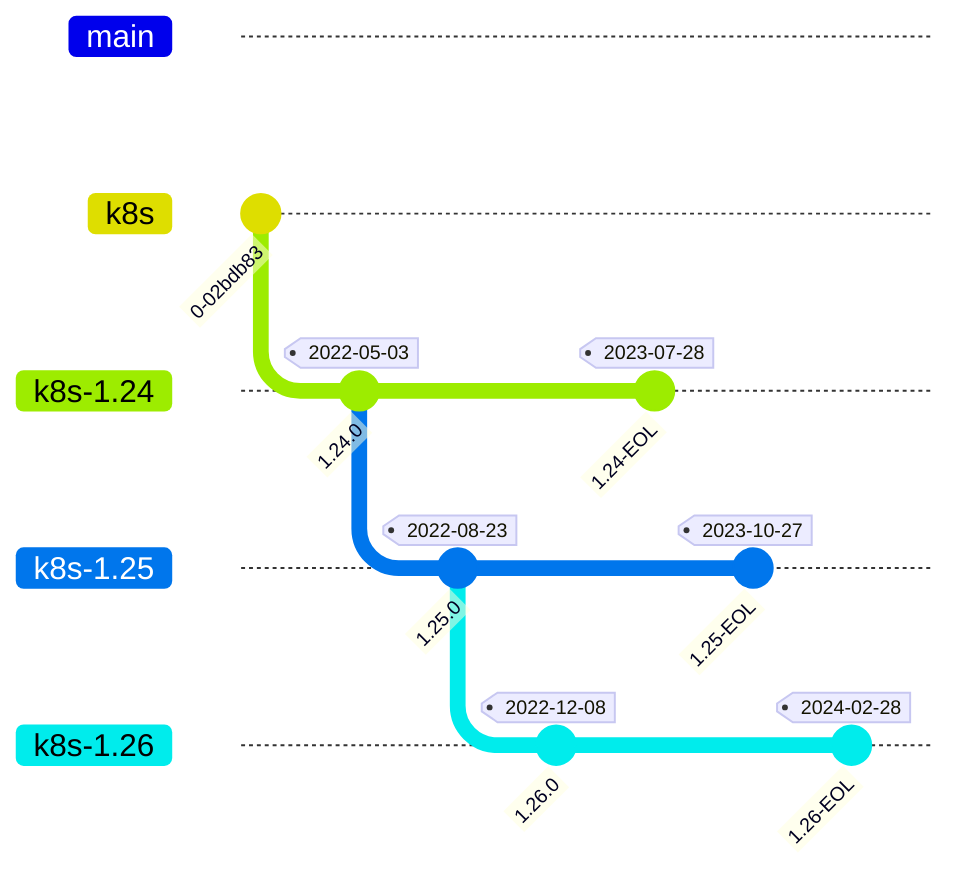

# k3s versions

K3s, Kubernetes, and other clustered software has the property of not being able to update atomically. Most software in nixpkgs, like for example bash, can be updated as part of a "nixos-rebuild switch" without having to worry about the old and the new bash interacting in some way.

K3s/Kubernetes, on the other hand, is typically run across several NixOS machines, and each NixOS machine is updated independently. As such, different versions of the package and NixOS module must maintain compatibility with each other through temporary version skew during updates.

The upstream Kubernetes project [documents this in their version-skew policy](https://kubernetes.io/releases/version-skew-policy/#supported-component-upgrade-order).

Within nixpkgs, we strive to maintain a valid "upgrade path" that does not run
afoul of the upstream version skew policy.

## Upstream release cadence and support

K3s is built on top of K8s, and typically provides a similar release cadence and support window (simply by cherry-picking over k8s patches). As such, we assume k3s's support lifecycle is identical to upstream K8s.

This is documented upstream [here](https://kubernetes.io/releases/patch-releases/#support-period).

In short, a new Kubernetes version is released roughly every 4 months, and each release is supported for a little over 1 year.

Any version that is not supported by upstream should be dropped from nixpkgs.

## Versions in NixOS releases

NixOS releases should avoid having deprecated software, or making major version upgrades, wherever possible.

As such, we would like to have only the newest K3s version in each NixOS
release at the time the release branch is branched off, which will ensure the
K3s version in that release will receive updates for the longest duration
possible.

However, this conflicts with another desire: we would like people to be able to upgrade between NixOS stable releases without needing to make a large enough k3s version jump that they violate the Kubernetes version skew policy.

To give an example, we may have the following timeline for k8s releases:

(Note, the exact versions and dates may be wrong, this is an illustrative example, reality may differ).

(Note: the above graph will render if you view this markdown on GitHub, or when using [mermaid](https://mermaid.js.org/))

In this scenario even though k3s 1.24 is still technically supported when the NixOS 23.05
release is cut, since it goes EOL before the NixOS 23.11 release is made, we would
not want to include it. Similarly, k3s 1.25 would go EOL before NixOS 23.11.

As such, we should only include k3s 1.26 in the 23.05 release.

We can then make a similar argument when NixOS 23.11 comes around to not
include k3s 1.26 or 1.27. However, that means someone upgrading from the NixOS
22.05 release to the NixOS 23.11 would not have a supported upgrade path.

In order to resolve this issue, we propose backporting not just new patch releases to older NixOS releases, but also new k3s versions, up to one version before the first version that is included in the next NixOS release.

In the above example, where NixOS 23.05 included k3s 1.26, and 23.11 included k3s 1.28, that means we would backport 1.27 to the NixOS 23.05 release, and backport all patches for 1.26 and 1.27.
This would allow someone to upgrade between those NixOS releases in a supported configuration.
